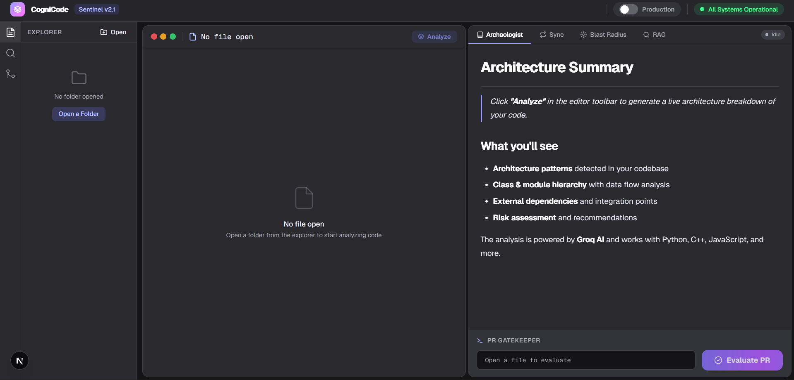
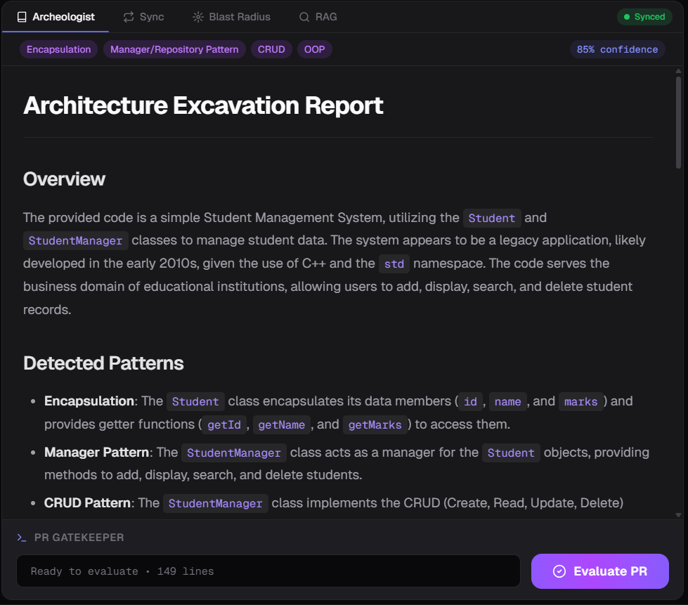
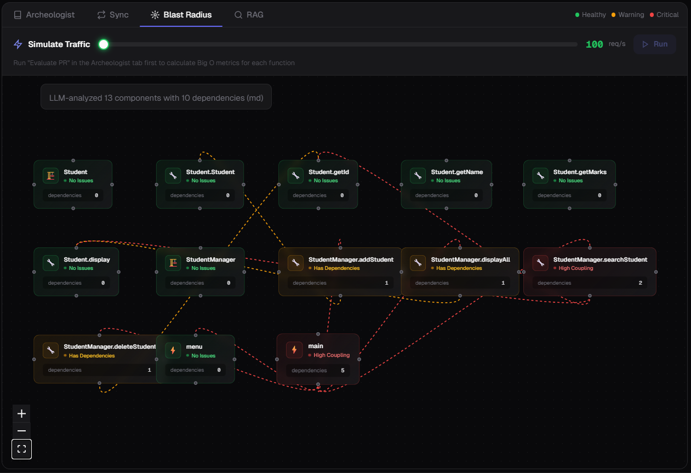
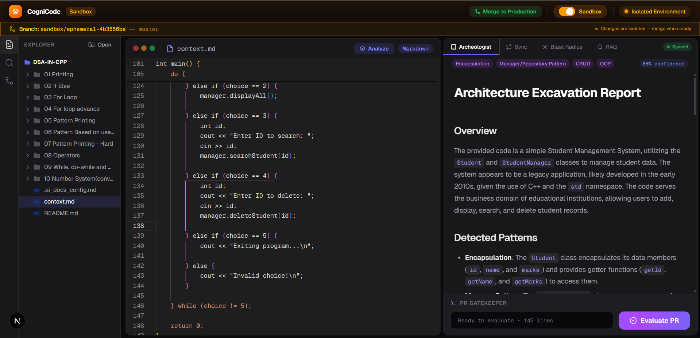
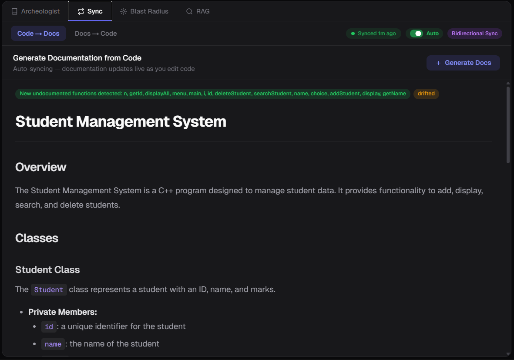

<div align="center">

# CogniCode

**AI-Powered Codebase Intelligence Platform**

[](/) [](/) [](/)

</div>

---

## The Problem

Engineering teams inherit massive codebases with zero documentation, make "safe" changes that cascade into outages, and lose institutional knowledge when people leave. **CogniCode** combines real-time AST analysis, LLM-powered reasoning, vector-embedded knowledge (ChromaDB), ephemeral GitOps sandboxing, and real stress testing into a single developer dashboard.

---

## Screenshots

<table>
<tr>
<td width="50%"></td>
<td width="50%"></td>
</tr>
<tr>
<td align="center"><strong>Main Dashboard & Code Editor</strong></td>
<td align="center"><strong>Legacy Archeologist</strong></td>
</tr>
<tr>
<td width="50%"></td>
<td width="50%"></td>
</tr>
<tr>
<td align="center"><strong>Blast Radius Dependency Graph</strong></td>
<td align="center"><strong>Traffic Simulator & GitOps Sandbox</strong></td>
</tr>
<tr>
<td colspan="2"></td>
</tr>
<tr>
<td colspan="2" align="center"><strong>Bidirectional Code ↔ Docs Sync</strong></td>
</tr>
</table>

---

## Tech Stack

<p align="center">
  
  
  
  
  
  
  
  
  
</p>

---

## Features

| Feature | Description |
|---------|-------------|
| **Legacy Archeologist** | Auto-generates architecture blueprints from undocumented code via AST + LLM inference. Detects design patterns, flags anti-patterns, computes confidence scores. |
| **Blast Radius Graph** | Interactive React Flow visualization of cross-file dependencies. Click any module to see what breaks — color-coded by severity. |
| **Risk Map** | Every file scored by coupling, complexity, and size. Identifies high-risk modules before they cause production issues. |
| **Quality Gate** | One-click codebase-wide quality scan — cyclomatic complexity, cognitive complexity, Big-O estimates, and severity-leveled violations. |
| **Bidirectional Sync** | Live drift detection between code and documentation. Edit code → docs auto-regenerate. Edit docs → generate starter code. |
| **RAG Knowledge Engine** | ChromaDB-powered vector search. Ingest repos, ask questions in natural language, get answers with file-level citations. |
| **Stress Testing** | Fire 1–50 concurrent analysis workers on your codebase. Measures real latency (avg/p50/p95/max), throughput, and per-worker timelines. |
| **GitOps Sandbox** | One-click ephemeral branch spawning. Experiment in isolation, then merge or auto-abort on conflicts. |
| **Traffic Simulator** | Predicts cascading bottlenecks by cross-correlating code complexity with traffic patterns on the blast radius graph. |
| **Incremental Analysis** | Delta-based re-analysis sends only changed files with prior context to the LLM. ~62% token savings. |
| **Knowledge Graph** | Enriched graph with inheritance edges, composition detection, module clusters, and PageRank-style centrality scoring. |

---

## Getting Started

**Prerequisites:** Python 3.11+, Node.js 18+

```bash
# Clone
git clone https://github.com/alok-devforge/CogniCode.git
cd CogniCode

# Backend
cd backend
python -m venv venv
venv\Scripts\activate          # Windows (use source venv/bin/activate on Mac/Linux)
pip install -r requirements.txt
cp .env.example .env           # Add your Groq API key
python -m uvicorn main:app --reload --port 8000

# Frontend (new terminal)
cd cognicode-app
npm install
npm run dev
```

Open **http://localhost:3000** → Open a folder → **Analyze**.

> Get a free Groq API key at [console.groq.com](https://console.groq.com). Without a key, the app falls back to regex-based structural analysis.

---

## Architecture

```
┌──────────────────────────────────────────────────────────┐
│                    FRONTEND (Next.js 16)                  │
│                                                           │
│  CodeEditor · DependencyGraph · BidirectionalSync         │
│  CodebaseMap · CommandStation · RAGPanel · LoadTester      │
│                         ↓                                 │
│                      api.ts                               │
└───────────────────────────┬──────────────────────────────┘
                            │ HTTP :8000
┌───────────────────────────┴──────────────────────────────┐
│                   BACKEND (FastAPI)                       │
│                                                           │
│  main.py ── llm_service · ast_service · code_graph        │
│             knowledge_graph · rag_service · models         │
│                  ↓                        ↓               │
│            Groq API (3-model         ChromaDB             │
│             fallback chain)        (Vector Store)         │
└──────────────────────────────────────────────────────────┘
```

### LLM Fallback Chain

| Priority | Model | Notes |
|----------|-------|-------|
| 1st | `llama-3.3-70b-versatile` | Best quality — tried first |
| 2nd | `llama-3.1-8b-instant` | Auto-fallback on 429 rate limit |
| 3rd | `gemma2-9b-it` | Last resort before regex fallback |

---

## Project Structure

```
CogniCode/
├── backend/
│   ├── main.py                 # FastAPI server (25+ routes)
│   └── app/
│       ├── llm_service.py      # LLM integration + 3-model fallback
│       ├── ast_service.py      # Python AST parser
│       ├── code_graph.py       # Multi-language dependency graph (13+ langs)
│       ├── knowledge_graph.py  # Enriched graph with centrality scoring
│       ├── rag_service.py      # ChromaDB vectorization & search
│       ├── github_sync.py      # Bidirectional Git synchronization
│       ├── graph_assistant.py  # AI codebase chat assistant
│       ├── stress_engine.py    # Concurrent load testing engine
│       └── models.py           # Pydantic schemas
├── cognicode-app/
│   └── src/
│       ├── app/                # Next.js pages & layouts
│       ├── components/         # React UI components
│       └── lib/                # API client & state management
└── assets/images/              # Screenshots
```

---

## Supported Languages

Python · TypeScript · JavaScript · Go · Rust · Java · C/C++ · C# · Ruby · PHP · Swift · Kotlin · Dart

---

## Team

| Name | Role |
|------|------|
| **Alok** | Project Lead & AI/RAG Core |
| **Sabnur** | Frontend Foundation & Editor |
| **Oheli** | Visualizations & Blueprints |
| **Kalkita** | Systems Parsing & Syncing |

---

<div align="center">
  <sub>Built for engineering teams that refuse to let complexity win.</sub>
</div>
